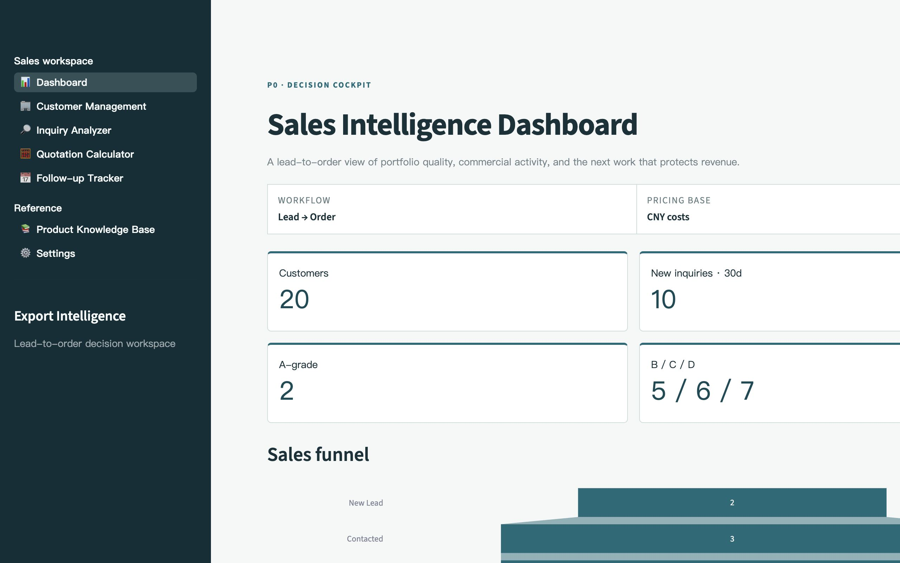
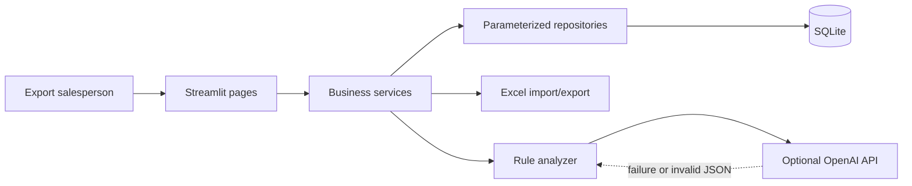
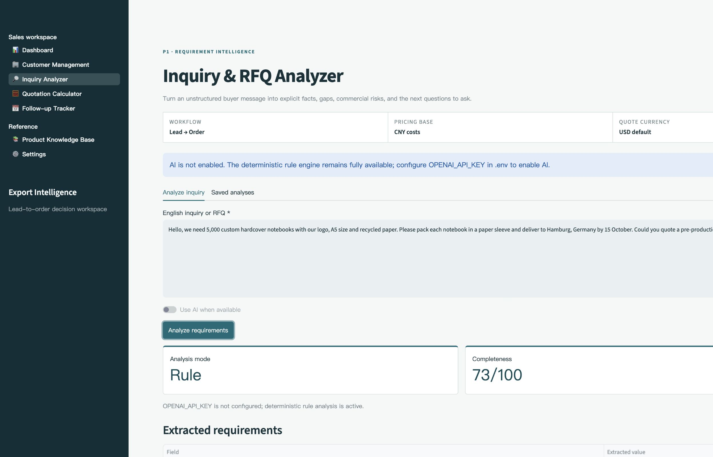
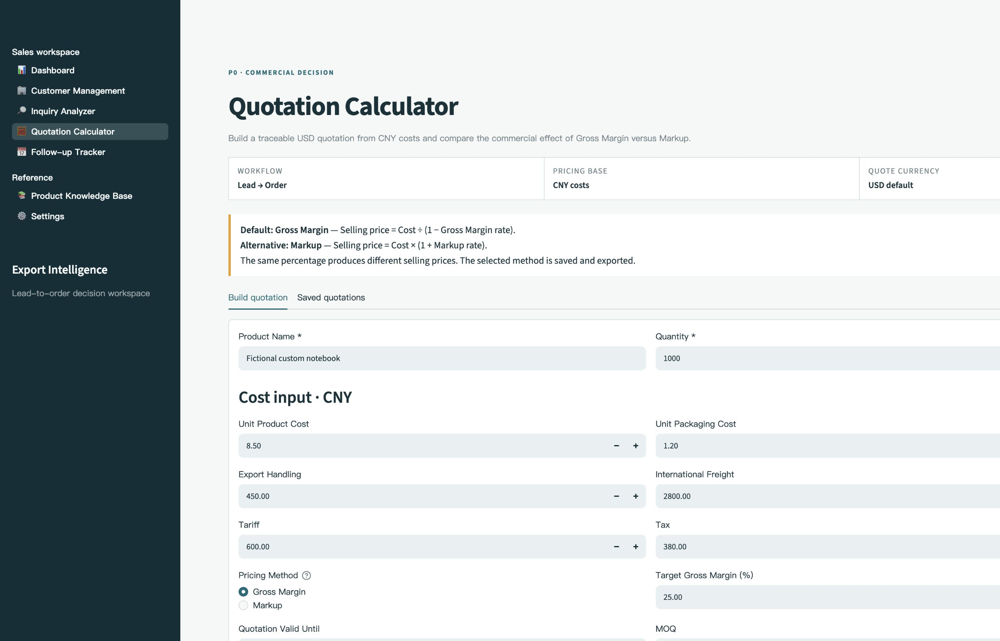

# AI-Powered B2B Export Sales Intelligence System

> A portfolio-ready Streamlit application that turns export-sales data into
> practical lead, inquiry, quotation, and follow-up decisions.



## 1. Project Overview

The **AI-Powered B2B Export Sales Intelligence System** is a local-first web
application for export sales professionals. It combines CRM-style customer
management, explainable lead scoring, inquiry analysis, Incoterm quotation
calculation, follow-up planning, and sales analytics in one simple workspace.

The project demonstrates applied Python programming, SQL data management,
business analysis, supply-chain knowledge, information-systems design, and a
practical AI integration with a deterministic fallback.

All bundled companies, people, email addresses, phone numbers, products,
transactions, and costs are fictional. Demo scenarios use creative-printing and
packaging products while the data model remains industry-neutral.

## 2. Business Problem

Export sales teams often manage leads across spreadsheets, inboxes, messaging
apps, and individual experience. That creates several operational problems:

- promising buyers are difficult to prioritize consistently;
- incomplete RFQs lead to inaccurate quotations and repeated clarification;
- Gross Margin and Markup are easily confused;
- international teams need an English/Chinese interface without changing
  stored business data;
- logistics and Incoterm cost assumptions are not transparent;
- overdue follow-ups are missed;
- customer, pipeline, and revenue data are hard to analyze together.

This system converts those fragmented activities into an explainable,
traceable lead-to-order workflow.

## 3. Key Features

### P0 — Core workflows

- **English / Chinese UI:** a persistent top-right language control localizes
  navigation, forms, tables, guidance, and quotation formulas while preserving
  canonical database values.
- **Dashboard:** customer KPIs, A/B/C/D grade distribution, 30-day inquiries,
  quoted/sample/won customers, expected sales, country/source distributions,
  sales funnel, and upcoming follow-ups.
- **Customer Management:** add, edit, delete, search, filter, CSV/XLSX import,
  safe Excel export, and complete lead fields.
- **Explainable Lead Scoring:** five visible dimensions totaling 100 points,
  grade reasoning, field-based automatic rules, and auditable manual overrides.
- **Quotation Calculator:** EXW, FOB, CIF, and DDP pricing; CNY-to-USD conversion;
  Gross Margin and Markup; unit/total quote, gross profit, gross margin, record
  persistence, commercial terms, and Excel quotation export.

### P1 — Sales intelligence

- **Inquiry Analyzer:** extracts 11 RFQ fields, lists confirmed and missing
  information, flags risks, proposes questions, scores completeness, and drafts
  an English reply.
- **Optional AI:** OpenAI Structured Outputs when configured, with schema
  validation and automatic rule-engine fallback on any failure.
- **Follow-up Tracker:** overdue prioritization, communication history,
  stage-specific advice, next dates, and short English messages.

### P2 — Reference tools

- **Product Knowledge Base:** searchable product, cost, MOQ, lead-time,
  packaging, question, and selling-point records.
- **Product Matching:** explainable keyword matches between inquiries and the
  knowledge base.
- **Settings:** runtime status, AI availability, quote convention, database
  location, and safe fictional demo-data initialization.

## 4. System Architecture



The architecture intentionally stays simple:

- `pages/` contains presentation and user interaction;
- `services/` contains scoring, pricing, analysis, export, matching, and
  dashboard logic;
- `database/` contains connections, schema initialization, repositories, and
  fictional seed data;
- `components/` contains reusable visual components;
- `utils/` contains constants and input validation;
- `tests/` verifies critical behavior independently of Streamlit.

## 5. Technology Stack

| Layer | Technology | Purpose |
|---|---|---|
| Application | Python 3.11+ | Business logic and data workflows |
| Web UI | Streamlit | Fast multipage business application |
| Database | SQLite | Portable local relational storage |
| Analysis | Pandas | Filtering, tabular data, and transfers |
| Visualization | Plotly | Funnel and distribution charts |
| Spreadsheet | openpyxl | Excel quotation and customer exports |
| AI | OpenAI Python SDK | Optional structured inquiry analysis |
| Testing | pytest / pytest-cov | Unit and integration testing |

## 6. Database Design

SQLite contains six required tables:

| Table | Responsibility |
|---|---|
| `customers` | Lead profile, stage, follow-up dates, automatic/manual scores |
| `inquiries` | Raw RFQ, extracted fields, risks, questions, reply, JSON evidence |
| `quotations` | Costs, method, rate, Incoterm, outputs, terms, calculation JSON |
| `follow_ups` | Communication content, outcome, priority, and next date |
| `products` | Product specifications, MOQ, costs, lead times, and selling points |
| `activities` | Auditable customer events such as score overrides and quotations |

Foreign keys are enabled, useful fields are indexed, and repository queries use
parameters instead of concatenating user values into SQL.

Initialize the schema and fictional dataset manually with:

```bash
python -m database.init_db
```

The dataset contains exactly 20 customers, 10 inquiries, 8 quotations,
10 follow-ups, and 6 products. Re-running the seed operation is idempotent.

## 7. Lead Scoring Methodology

The score is intentionally transparent rather than a black-box prediction.

| Dimension | Maximum | Example evidence |
|---|---:|---|
| Company authenticity | 20 | company name, business website, domain email, phone |
| Product fit | 25 | recorded product interest and meaningful product detail |
| Requirement clarity | 20 | quantity, specification, stage, and inquiry detail |
| Purchasing capacity | 20 | estimated volume and import frequency |
| Communication engagement | 15 | pipeline stage and recent contact evidence |

Grades:

- **A:** 80–100
- **B:** 65–79
- **C:** 45–64
- **D:** 0–44

The customer page shows every dimension and its reason. A user may override the
automatic score, but an explanation is mandatory and the original automatic
score remains available for auditability.

## 8. Quotation Logic

All cost inputs default to CNY. The exchange-rate convention is:

```text
1 USD = X CNY
USD quote = CNY quote / X
```

### Gross Margin — default

```text
Selling price = Cost / (1 - Gross Margin rate)
```

Gross Margin measures profit as a percentage of the selling price.

### Markup — alternative

```text
Selling price = Cost * (1 + Markup rate)
```

Markup measures profit as a percentage of cost. The application labels and
stores the selected method because the same percentage does not produce the
same selling price.

### Incoterm cost inclusion

| Term | Included cost categories |
|---|---|
| EXW | product + packaging + platform/bank fee |
| FOB | EXW + domestic transportation + export handling |
| CIF | FOB + international freight + insurance |
| DDP | CIF + tariff and tax |

Product and packaging values are unit costs. Other cost fields are entered for
the full quotation. Money uses `Decimal` and commercial `ROUND_HALF_UP` rounding
to two decimal places.

## 9. Installation Instructions

```bash
git clone <your-repository-url>
cd "AI-Powered B2B Export Sales Intelligence System"

python3 -m venv .venv
source .venv/bin/activate
python -m pip install -r requirements.txt

cp .env.example .env
chmod 600 .env
python -m database.init_db
```

Windows activation:

```powershell
.venv\Scripts\activate
```

`OPENAI_API_KEY` is optional. Leave it empty to use the rule analyzer.

## 10. How to Run

```bash
source .venv/bin/activate
streamlit run app.py
```

Open [http://localhost:8501](http://localhost:8501).

Run tests:

```bash
python -m pytest
```

Optional coverage report:

```bash
python -m pytest --cov=services --cov=database --cov-report=term-missing
```

## 11. Example Use Cases

1. **Qualify a new lead:** add a fictional buyer, inspect its five scoring
   dimensions, then schedule the next follow-up.
2. **Analyze an RFQ:** paste an English gift-box or notebook inquiry, identify
   missing freight and specification inputs, and use the suggested reply.
3. **Compare pricing conventions:** calculate a 25% Gross Margin quote and a
   25% Markup quote to see the commercial difference.
4. **Build an Incoterm comparison:** review EXW, FOB, CIF, and DDP cost inclusion
   before selecting the primary quotation term.
5. **Review the pipeline:** use the dashboard to see lead quality, country
   concentration, funnel stages, expected sales, and due follow-ups.

## 12. Screenshots

### Dashboard


### Inquiry analyzer



### Quotation calculator



The screenshots use only fictional portfolio data. Additional deployment
screenshots can be added under `assets/screenshots/`.

## 13. Privacy and Data Disclaimer

- All bundled names, companies, domains, phone numbers, products, transactions,
  prices, and costs are fabricated for demonstration.
- `.env` and local SQLite database files are ignored by Git.
- API keys are read only from environment variables.
- The local server binds to `127.0.0.1`; add authentication and authorization
  before any LAN, cloud, or public deployment.
- The local data directory and SQLite file are created with restrictive
  permissions where supported. SQLite remains plaintext storage.
- Spreadsheet text is neutralized when it begins with an Excel formula prefix.
- If OpenAI mode is enabled, the inquiry text is sent to the configured external
  API provider. Do not submit confidential customer or company information
  without authorization and an appropriate data-processing policy.
- This application is an educational portfolio system, not legal, customs,
  tax, accounting, or binding commercial advice.

## 14. Future Improvements

- user authentication and role-based access;
- persistent multi-currency settings and exchange-rate history;
- email/calendar integrations and automated reminders;
- quotation approval workflow and PDF templates;
- HS-code, tariff, and route data integrations;
- contact deduplication and import field mapping;
- deployment profiles for PostgreSQL and managed hosting;
- richer AI evaluation datasets and multilingual inquiry analysis;
- customer lifetime value and win-probability models after sufficient data is
  available.

## 15. Resume Bullet Points

- Built a multipage B2B export-sales intelligence application with Python,
  Streamlit, SQLite, Pandas, and Plotly, integrating customer management,
  explainable lead scoring, pipeline analytics, and follow-up workflows.
- Developed a tested Incoterm quotation engine supporting EXW, FOB, CIF, and DDP
  pricing, CNY-to-USD conversion, Gross Margin versus Markup logic, auditable
  calculation evidence, and Excel quotation generation.
- Implemented a resilient AI-assisted RFQ analysis pipeline using structured
  JSON validation, deterministic rule-based fallback, product matching, and
  privacy-safe fictional demo data across six relational tables.

## Project Structure

```text
.
├── app.py
├── pages/
│   ├── dashboard.py
│   ├── customers.py
│   ├── inquiry_analyzer.py
│   ├── quotation_calculator.py
│   ├── follow_up_tracker.py
│   ├── products.py
│   └── settings.py
├── components/
│   └── theme.py
├── services/
│   ├── dashboard.py
│   ├── scoring.py
│   ├── inquiry_analyzer.py
│   ├── quotation.py
│   ├── followup.py
│   ├── product_match.py
│   └── excel_service.py
├── database/
│   ├── connection.py
│   ├── init_db.py
│   ├── repository.py
│   └── seed_data.py
├── utils/
├── tests/
├── data/
├── assets/screenshots/
├── gan-harness/
├── requirements.txt
├── .env.example
└── README.md
```
