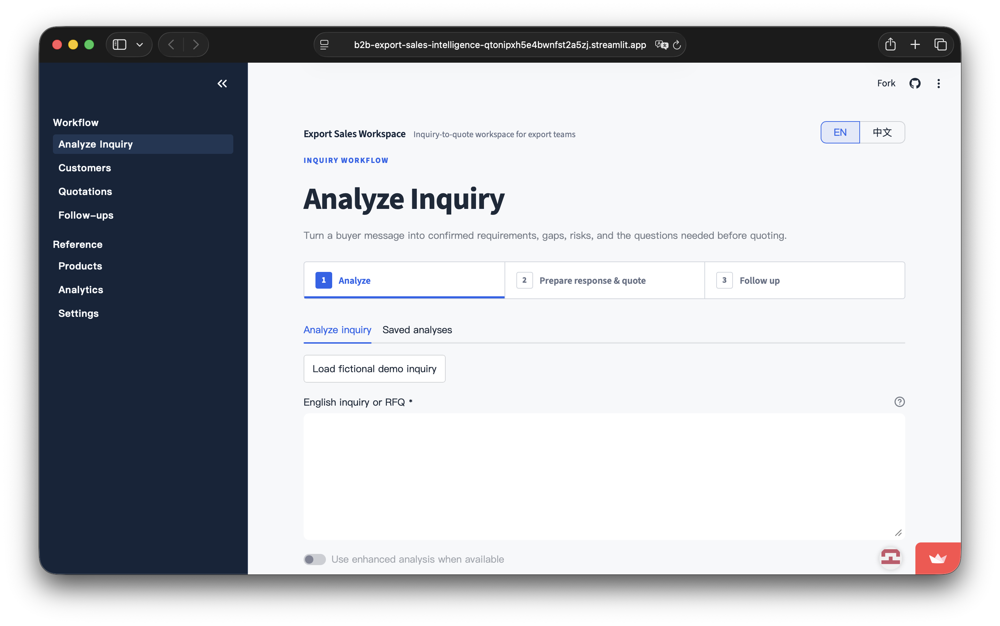
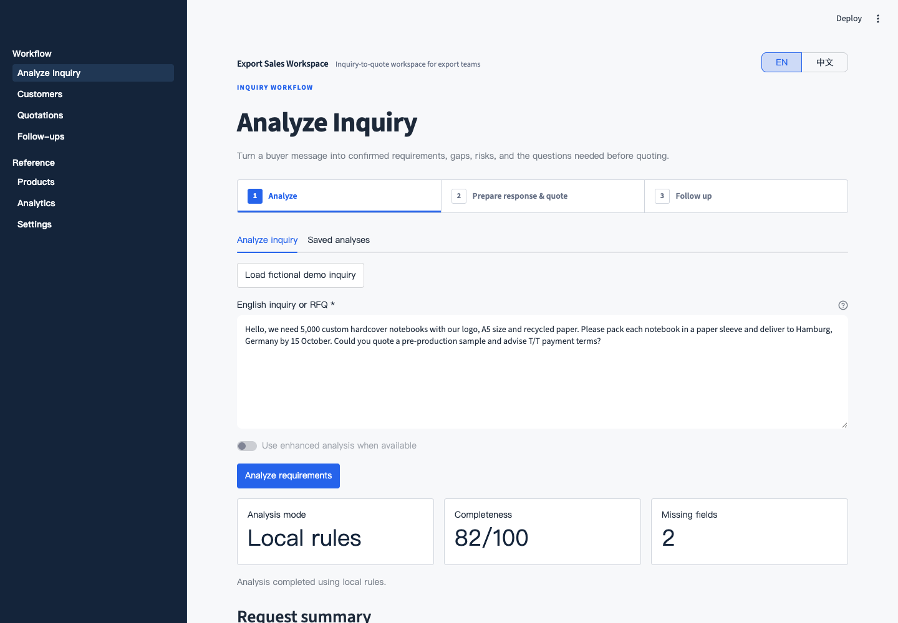
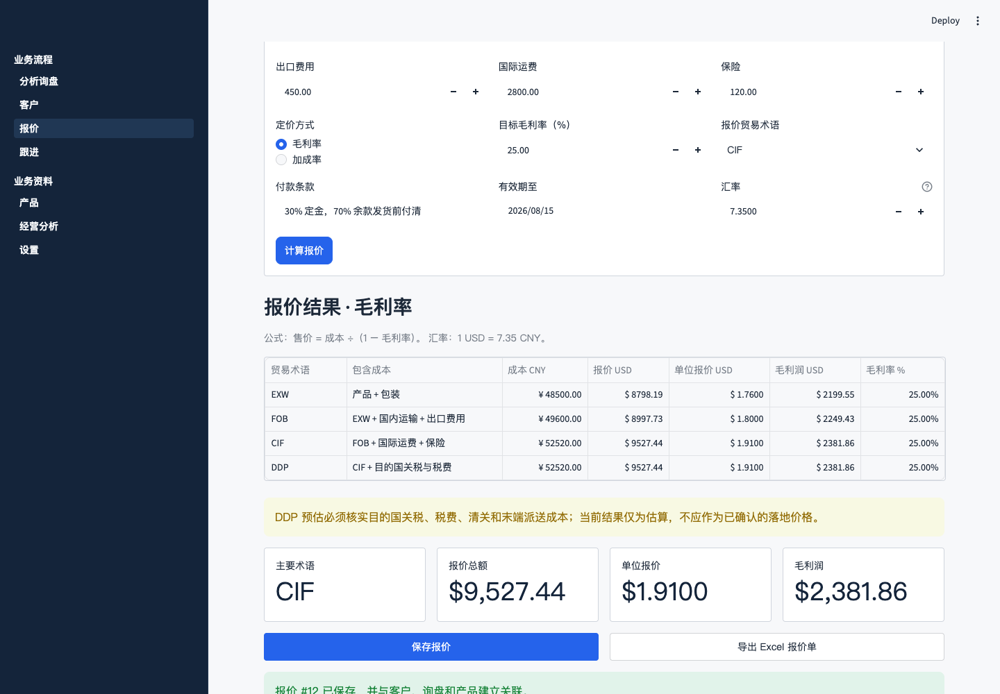
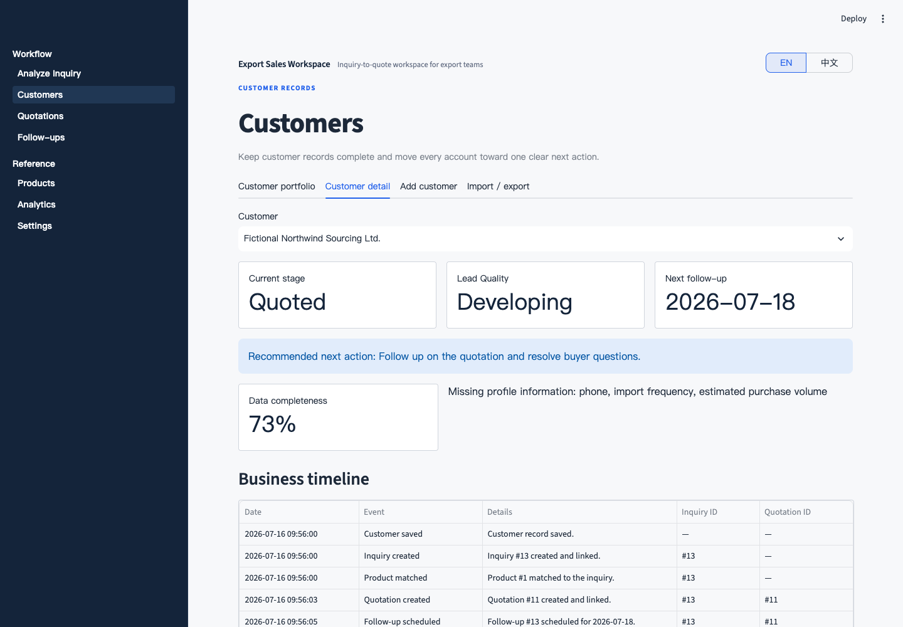
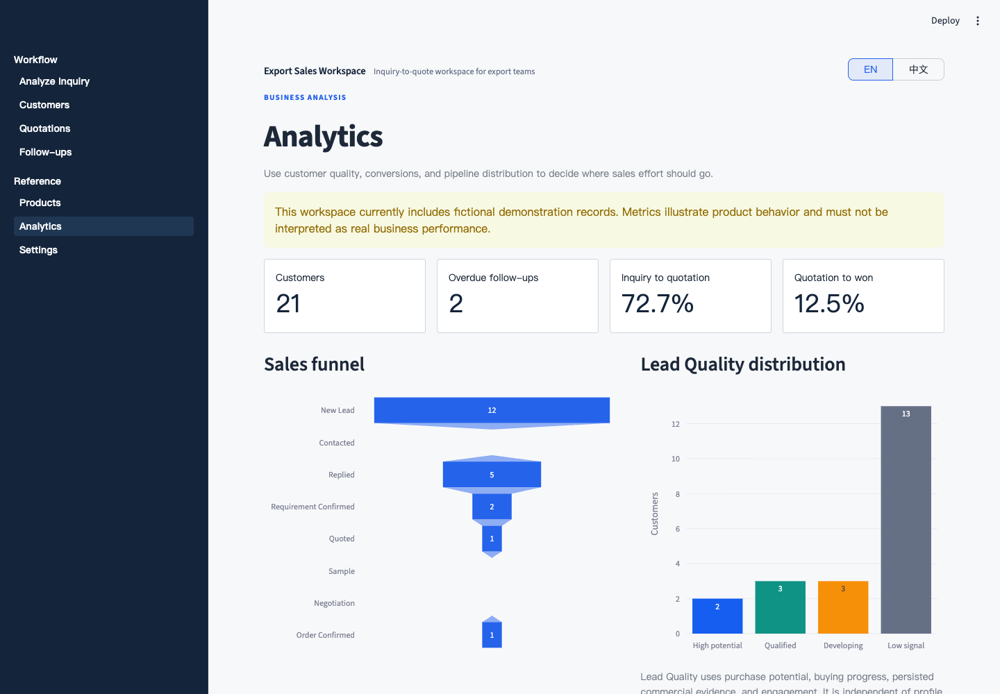
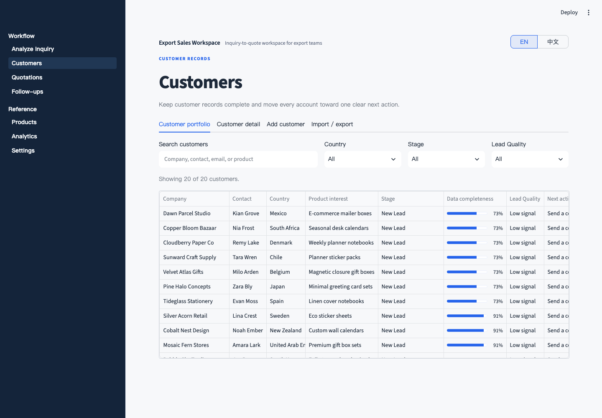
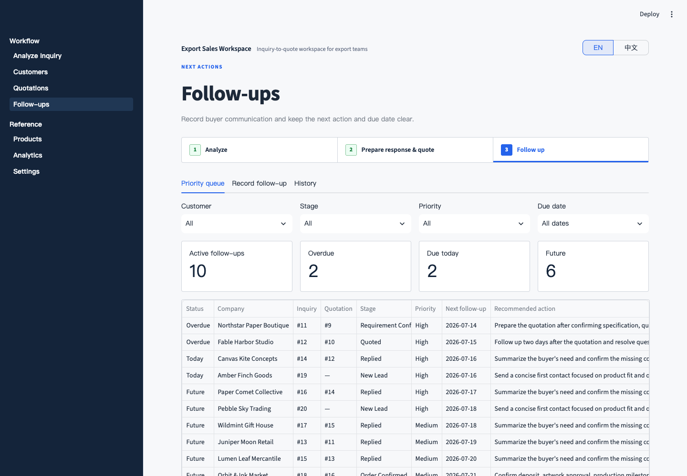
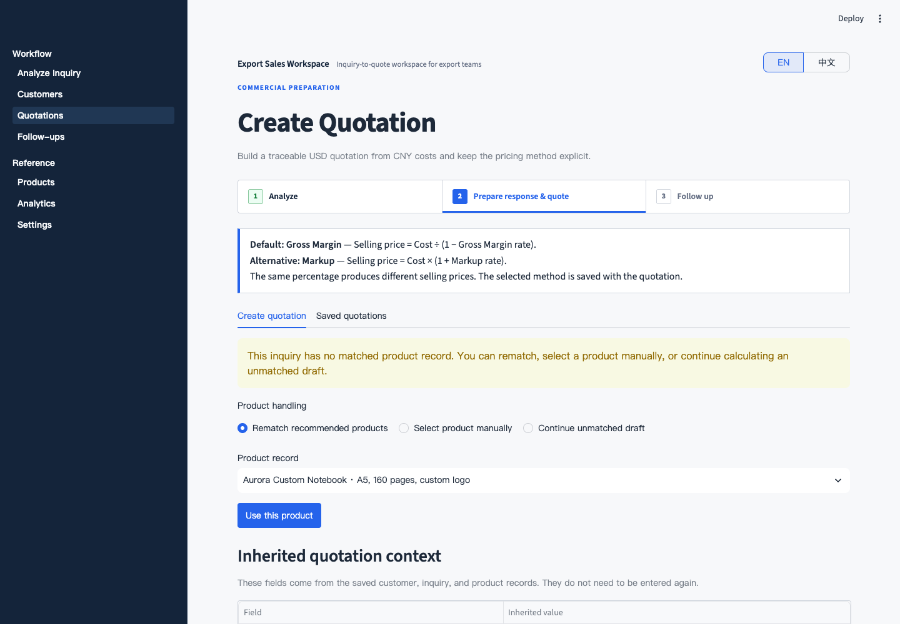
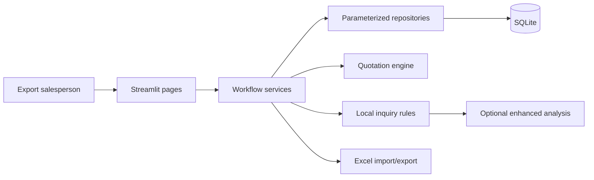
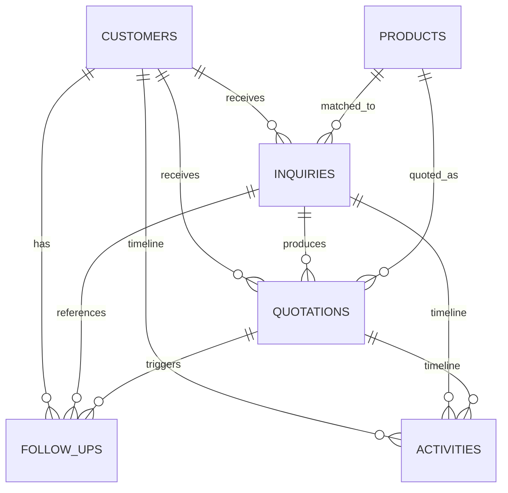

# B2B Export Sales Workspace

[](https://github.com/hql7-luo/b2b-export-sales-intelligence/actions/workflows/tests.yml)
[](https://www.python.org/)
[](https://streamlit.io/)
[](LICENSE)
[](https://b2b-export-sales-intelligence-qtonipxh5e4bwnfst2a5zj.streamlit.app/)
[](https://colab.research.google.com/github/hql7-luo/b2b-export-sales-intelligence/blob/main/notebooks/export_sales_intelligence_demo.ipynb)

A bilingual, local-first workspace that helps export sales teams turn an
English buyer message into a traceable customer record, quotation, and
follow-up task.

## What problem it solves

Export sales work often moves between inboxes, spreadsheets, chat tools, and
individual memory. That makes it easy to:

- quote before specifications, quantity, or destination are confirmed;
- confuse Gross Margin with Markup;
- re-enter the same customer and inquiry facts on multiple pages;
- lose the relationship between an inquiry, quotation, and follow-up;
- miss overdue work or prioritize customers by incomplete profile data alone.

This application creates one small operating workspace for those decisions.
SQLite stores the long-term business relationships; Streamlit Session State is
used only for temporary page-to-page context.

## Core workflow

**Analyze Inquiry → Prepare Quotation → Follow Up**

The application preserves the customer, inquiry, matched product, quotation,
and follow-up relationships across the workflow. It does not attempt to replace
an ERP, customs platform, or order-execution system. Optional enhanced inquiry
analysis is supported, but the complete core workflow runs without an API key.

## Live Demo

[Open the public Streamlit workspace](https://b2b-export-sales-intelligence-qtonipxh5e4bwnfst2a5zj.streamlit.app/)
or use the Live Demo badge above. The deployed application uses fictional data
and works in local-rules mode without an API key.

Streamlit Community Cloud may restart the application and reinitialize its
local SQLite database. Treat the online workspace as a resettable demonstration,
not durable storage, and do not enter confidential customer information.

## Screenshots

### Public bilingual workspace



### End-to-end workflow







### Decision-focused analytics



## How to use it

1. Open **Analyze Inquiry** and load the fictional demo inquiry or paste an
   English RFQ.
2. Review the request summary, missing information, risks, recommended
   questions, product match, and editable professional English reply.
3. Link an existing customer or create a new customer, then save the inquiry.
4. Open **Create Quotation**. Customer, inquiry, product, quantity,
   specification, destination, and database IDs are inherited automatically.
5. Enter costs, exchange rate, pricing method, terms, and validity, then save
   the quotation.
6. Create a linked follow-up. The customer, inquiry, quotation, stage, and
   recommended follow-up date are inherited.

The language control in the upper-right switches the interface between English
and Simplified Chinese without clearing the current workflow context or form
inputs. Customer-facing suggested replies remain professional English.

## Core capabilities

| Area | What is included |
|---|---|
| Inquiry | Demo inquiry, structured summary, graded information gaps, risk categories, recommended questions, editable English reply |
| Customers | Independent Data Completeness and commercial Lead Quality, filters, next action, editing, import/export, business timeline |
| Products | Compact specification, MOQ, cost, packaging, sample lead time, production lead time, and match-usage management |
| Quotations | EXW, FOB, CIF, DDP, CNY-to-USD conversion, Gross Margin or Markup, per-quotation exchange rate, Excel export |
| Follow-ups | Overdue/today/future task queue, customer/stage/priority/date filters, Inquiry and Quotation references |
| Analytics | Customer count, Lead Quality distribution, overdue work, conversion rates, funnel, source, and country distributions |
| Settings | Editable default exchange rate, concise analysis status, fictional demo-data ensure/reset controls |

### Professional customer portfolio



Data Completeness measures whether the customer record is usable. Lead Quality
is separate and uses commercial value: purchase potential, buying progress,
persisted inquiry/quotation evidence, and engagement.

### Follow-up task queue



Tasks are grouped into overdue, today, and future work. Each persisted task
shows its customer, stage, priority, Inquiry ID, and Quotation ID.

### Unmatched product handling



An older inquiry without a matched product can be rematched, assigned manually,
or used to calculate an unmatched draft. Formal saving requires explicit
product verification.

## Quotation logic

All costs are entered in CNY. The exchange-rate definition is:

```text
1 USD = X CNY
USD quote = CNY quote ÷ X
```

The workspace setting supplies a default exchange rate. Each quotation can
override it without changing the default.

### Gross Margin — default

```text
Selling price = Cost ÷ (1 - Gross Margin rate)
```

Gross Margin measures profit as a percentage of selling price.

### Markup — alternative

```text
Selling price = Cost × (1 + Markup rate)
```

Markup measures profit as a percentage of cost. A 25% Gross Margin and a 25%
Markup do not produce the same selling price, so the selected method is labeled
and persisted.

Estimated DDP results retain an explicit warning because destination-country
tariff, tax, customs, and final-delivery assumptions require verification.

## Architecture



- `pages/` owns presentation and user interaction.
- `services/` owns inquiry, customer-quality, matching, quotation, follow-up,
  analytics, and workflow rules.
- `database/` owns initialization, forward migrations, repositories, and
  fictional demo data.
- `locales/` contains stable English and Simplified Chinese translation keys.
- `components/` contains the approved visual system and workflow context.

## Database relationships



Core persisted links:

- `inquiries.customer_id`
- `inquiries.matched_product_id`
- `quotations.customer_id`
- `quotations.inquiry_id`
- `quotations.product_id`
- `follow_ups.customer_id`
- `follow_ups.inquiry_id`
- `follow_ups.quotation_id`
- optional `activities.inquiry_id` and `activities.quotation_id`

Migrations are forward-only and idempotent. They preserve existing records,
avoid duplicate columns/indexes, and are tested with SQLite integrity and
foreign-key checks.

## Fictional demo data

All bundled companies, people, domains, phone numbers, products, inquiries,
costs, quotations, follow-ups, and business outcomes are fictional.

The clean demo contains:

- 20 customers
- 10 inquiries
- 8 quotations
- 10 follow-ups
- 6 products

**Ensure demo data** adds missing bundled records. **Reset fictional demo data**
replaces only bundled demo records and preserves user-created records. Browser
QA data is created in temporary databases and is not part of the seed.

## Installation

Python 3.11 or later is recommended.

```bash
git clone https://github.com/hql7-luo/b2b-export-sales-intelligence.git
cd b2b-export-sales-intelligence

python3 -m venv .venv
source .venv/bin/activate
python -m pip install --upgrade pip
python -m pip install -r requirements.txt

cp .env.example .env
python -m database.init_db
```

Windows activation:

```powershell
.venv\Scripts\activate
```

`OPENAI_API_KEY` is optional. Leave it empty to use local inquiry rules.

## Run

```bash
source .venv/bin/activate
streamlit run app.py
```

Open [http://localhost:8501](http://localhost:8501).

To use a separate database:

```bash
DATABASE_PATH=data/another-workspace.db streamlit run app.py
```

A new database initializes automatically and receives fictional demo data on
its first application run.

## Test

```bash
python -m pytest
```

Optional coverage:

```bash
python -m pytest --cov=services --cov=database --cov-report=term-missing
```

Tests cover pricing formulas, inquiry analysis, repository safety, migrations,
workflow relationships, translation keys, demo reset behavior, release files,
and application smoke rendering.

## Deployment

### GitHub Actions

`.github/workflows/tests.yml` installs `requirements.txt` with Python 3.11 and
runs the complete pytest suite on pushes and pull requests.

### Streamlit Community Cloud

The repository includes the root `requirements.txt` and
`.streamlit/config.toml` expected by Streamlit Community Cloud.

The public demonstration is available at:

**[b2b-export-sales-intelligence-qtonipxh5e4bwnfst2a5zj.streamlit.app](https://b2b-export-sales-intelligence-qtonipxh5e4bwnfst2a5zj.streamlit.app/)**

To deploy another instance:

1. Select `app.py` as the entrypoint.
2. Select Python 3.11 in Advanced settings.
3. Leave `OPENAI_API_KEY` empty to use the complete local-rules workflow.
4. Add secrets only when optional enhanced analysis is intentionally enabled.

References:
[Streamlit deployment](https://docs.streamlit.io/deploy/streamlit-community-cloud/deploy-your-app/deploy),
[dependencies](https://docs.streamlit.io/deploy/streamlit-community-cloud/deploy-your-app/app-dependencies),
and [secrets](https://docs.streamlit.io/deploy/streamlit-community-cloud/deploy-your-app/secrets-management).

The online Demo uses Streamlit-local SQLite and may reset or reinitialize when
the container restarts or the app is redeployed. It is suitable for a
demonstration, not durable multi-user production data. Use a managed database
and authentication before handling real customer information.

### Colab demo

Open the
[Google Colab demo](https://colab.research.google.com/github/hql7-luo/b2b-export-sales-intelligence/blob/main/notebooks/export_sales_intelligence_demo.ipynb)
to run seven code cells directly from the GitHub `main` branch. It demonstrates
customer scoring, inquiry analysis, Gross Margin versus Markup, quotation
outputs, and decision-focused business charts using only fictional data. No API
key is required.

## Limitations

- This is a portfolio-grade single-workspace application, not a multi-tenant
  production system.
- SQLite has no built-in user authentication and is plaintext at rest.
- Streamlit Community Cloud storage may be ephemeral.
- DDP is an estimate until destination-country tariff, tax, customs, and
  final-delivery inputs are verified.
- Product matching is explainable keyword matching, not a product feasibility
  guarantee.
- Local inquiry rules are deterministic and do not replace salesperson review.
- External analysis, when enabled, sends inquiry text to the configured
  provider; confidential data requires authorization and an appropriate data
  policy.
- ERP, order execution, customs-data feeds, automated email/calendar actions,
  and advanced predictive models are intentionally out of scope.

## Project structure

```text
.
├── app.py
├── pages/
│   ├── inquiry_analyzer.py
│   ├── customers.py
│   ├── quotation_calculator.py
│   ├── follow_up_tracker.py
│   ├── products.py
│   ├── dashboard.py
│   └── settings.py
├── services/
│   ├── inquiry_analyzer.py
│   ├── inquiry_brief.py
│   ├── customer_intelligence.py
│   ├── product_match.py
│   ├── quotation.py
│   ├── workflow.py
│   ├── followup.py
│   └── dashboard.py
├── database/
│   ├── connection.py
│   ├── init_db.py
│   ├── migrations.py
│   ├── repository.py
│   └── seed_data.py
├── components/
├── locales/
├── tests/
├── docs/screenshots/
├── notebooks/export_sales_intelligence_demo.ipynb
├── .github/workflows/tests.yml
├── .streamlit/
├── LICENSE
├── requirements.txt
└── README.md
```

## Resume description

- Built a bilingual Streamlit and SQLite export-sales workspace that persists
  the complete Inquiry → Quotation → Follow-up relationship and customer
  timeline.
- Implemented a tested quotation engine for EXW, FOB, CIF, DDP, Gross Margin,
  Markup, per-quotation exchange rates, and Excel output.
- Designed decision-focused customer quality, follow-up queue, product
  reference, and sales analytics modules using Python, SQL, Pandas, and Plotly.
